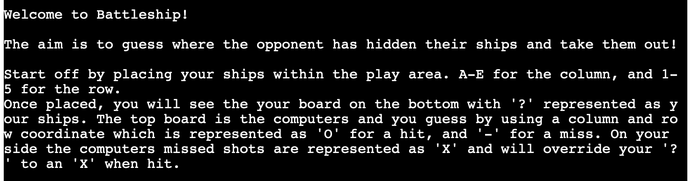
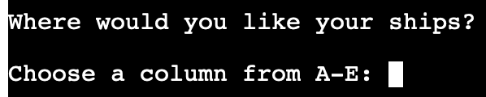
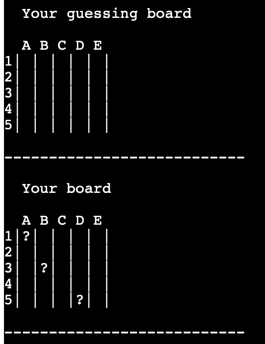
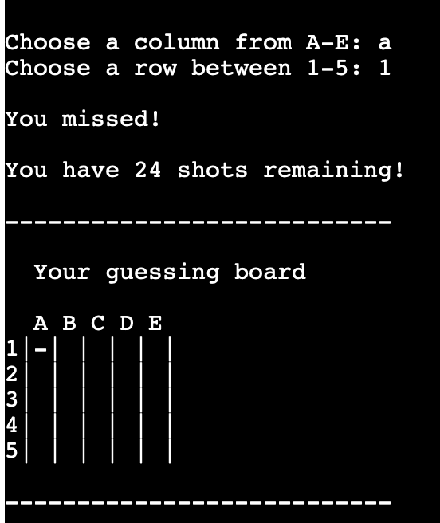
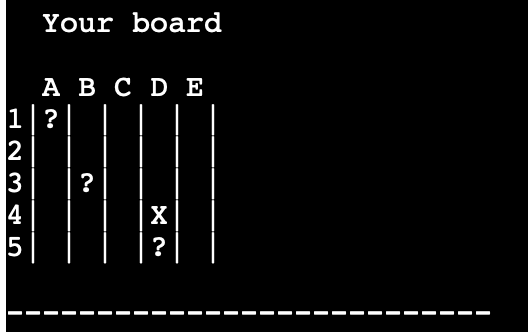
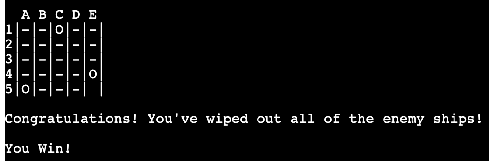
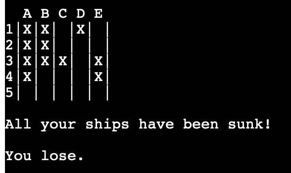
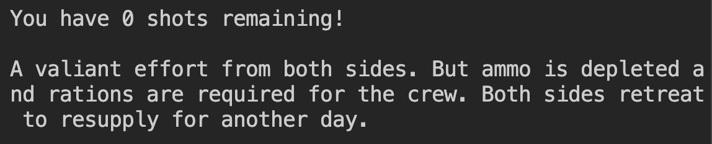
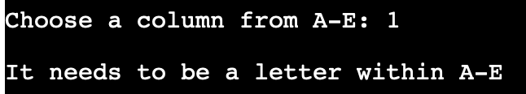
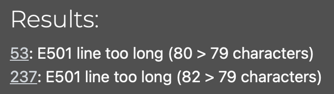

# Battleships

[Link to game](https://battleships-ci.herokuapp.com/)

## Description

I've designed this game to allow players to play the game Battleships against a computer which randomly decides its ship placement and guesses towards the players board. It also has prompts to allow the player to choose the column and row of where they would like to guess the computers ship.

### Overview

Upon opening the website to play the game. The player is presented with a welcome message and a small guide on how to play the game.



Below that, it prompts the user for input for their first ship by asking for the column first. 



Once the player has chosen an appropriate column and row, three times, it brings up the game boards. 
These game boards represent the guess board as the computers board (which is hidden from the player) and the players board with their ship placement. 



They are able to again, choose a column and row to guess from. A miss will be shown as a - and a hit is a O. At the same time, the computer makes their guess and will use an X to mark where it shot. This overrides the players ? if successsfully hit. If the computer has hit a players ship, a message will show at the top of the game boards telling the player one or more of their ships have been hit. 




If the player is able to hit all the enemy ships, there is a congratulations message to tell the player they have won.



If the player loses all their ships before they can guess where the computers ships are, a message will tell the player they have lost.



There is also a third message for when the turns have run out. At the moment, the turns have been set to 25 (the maximum amount of squares). If this is lowered the third message can show on the screen for when the turns run out, it effectively becomes a tie. At some point I would like to be able to implement a way for the user to select two game modes before starting the game. One would be the "full game" with all 25 turns so all ships must be hit be either player. Or a "quick game" where there is a limited amount of turns that they must win in or risk a tie. 



With any of these outcomes, there is an option that is presented to the player to restart the game again. Asking a simple Y or N option. If N is selected, there is a "Quitting game..." message before breaking. If "Y" is selected, the game restarts with asking the player where they would like their ships. 


If the player ever enters anything that doesn't correspond with the prompted question. It will reply with an appropriate error message and give the opportunity to redo the input.



### Design

The design is very simple to accomodate the CLI. I went with a simple 5x5 grid, split by "|" text inbetween the spaces.

## Strategy

### Users Stories

Users might visit the page for various reasons:

- A quick timewaster to see if they can beat a computer in Battleships
- A player looking for a logic game with different choices every time.
- A lightweight game that can run on any machine regardless of PC specifications.

### Scope

Users might expect: 

- A simple message with instructions on how to play.
- An easy way to coordinate where they want to play their turn. 
- An opporunity to play the game again without having to refresh the window.

### Structure

The game takes place in a CLI. So new lines are processed for every action they make. Meaning they can scroll up to see what they did before.

### Future Features

- I would like to implement the "Full Game" and "Quick Game" options brought up earlier to allow the player to choose between two different styles of game.
- A way to have ships of different sizes i.e. a ship that takes up 2, 3 or 4 spaces in a vertical or horizontal line.

### Testing

I have tested the program on different computers using just the file itself and it runs without an issue.

### Validator Testing

In accordance to PEP8 I have followed almost all the recommended rules applied to my code. I used the CI Linter to check. Apart from a few comments being 80 characters long. And one if statement being much longer. 



## Deployment

This website was developed using [VS Studio Code](https://code.visualstudio.com). It was added, committed and pushed using git to a GitHub repository.

To deploy this project to Heroku from [the repository](https://github.com/Kuurosu/battleships) the following was done:

1. Log into the [Heroku website](https://id.heroku.com/login).
2. Within the dashboard, select "New" and "Create New App".
3. Create a unique name for the app.
4. Choose your region.
5. Click "Create App".
6. Once created, go to the Settings tab.
7. Scroll down to the config vars section and select "Reveal Config Vars"
8. Add necessary config vars. For this one you just need to add key PORT and value 8000.
9. Click "Add"
10. Go down to the Buildpacks and click Add Buildpacks
11. Add the necessary buildpacks. For this one, select Python first and then Save Changes. Then click Add buildpacks again but this time select Nodejs, then Save Changes. Make sure you have them in that order. You can change the order by click and holding the 3 lines on the left of the names and move them up or down.
12. Go to the Deploy tab.
13. Select GitHub and confirm connection to GitHub account.
14. Search for the repository by typing in the exact name of the repository and click "Connect".
15. Scroll down to the deploy options.
16. Select automatic deploys if you would like automatic deployment with each new push to the GitHub repository.
17. In manual deploy, select which branch to deploy and click "Deploy Branch"
18. Heroku will start building the app
19. The link to the app can be found at the top of the page by clicking "Open app"

### Cloning

If you would like to clone the repository you can do the following:

1. Navigate to [GitHub CLI](https://cli.github.com).
2. On Mac, copy ```brew install gh``` On Windows, copy ```winget install --id GitHub.cli``` (You will need [HomeBrew](https://brew.sh) previously installed for Mac, or [WinGet](https://github.com/microsoft/winget-cli) previously installed for Windows.)
3. Paste the OS appropriate code into Terminal (Mac) or CMD prompt (Windows).
4. This will take a few minutes to install the appropriate GitHub CLI onto your PC.
5. Once completed, open the [repository](https://github.com/Kuurosu/battleships).
6. Click the green "Code" icon.
7. Click GitHub CLI tab.
8. Copy the link.
9. In your preferred IDE, create or navigate to a directory you would like to clone the repository to.
11. Open the IDE Terminal and paste the link from step 8. 
```
gh repo clone Kuurosu/battleships
```
12. Press enter and it should clone the repository for you to work with locally. 

Any issues or troubleshooting with GitHub CLI can be found [here](https://cli.github.com/manual/).

### Using Git to push changes to your repository 

To add updates from your local IDE to the repository you can use Git in the terminal to assist you with this:

1. Open the Terminal.
2. Type ```git add (insert file name here e.g. index.html)``` and press enter (You can also use ```git add .``` to add all files that have been modified).
3. Type ```git commit -m "(insert a meaningful commit message here)"``` and press enter.
4. When you're ready to push the commits, you can do so by typing ```git push``` and press enter.

## Credits

- I'd like to thank my mentor Brian Macharia for assisting me with the format of my code and reviews.
- I watched a few videos and also had done the CodeAcademy battleship game prior to doing this. Which helped me gain an understanding on how it's done before applying my own take on the game. I used [this video](https://www.youtube.com/watch?v=alJH_c9t4zw) to help when I was completely stuck.

